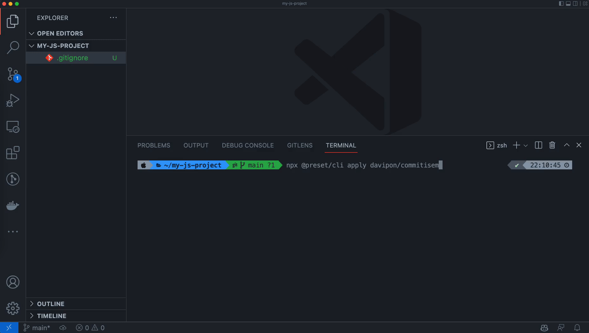

<h1 align="center">commitisem</h1>
<h3 align="center">Easily add Conventional Commits and SemVer integrations to JS project.</h3>

### 🙋 Why this?

I found myself repeatedly adding **Conventional Commits** & **SemVer** integrations to my new JS project.

So I decided to write a preset.

I also wrote an article about my setup: [Add Commitlint, Commitizen, Standard Version, and Husky to SvelteKit Project](https://davipon.hashnode.dev/add-commitlint-commitizen-standard-version-and-husky-to-sveltekit-project)

### 🛠 Usage

⚠️ Make sure your repository is initialized (`git init` or `git clone`) before you start.

```bash
# In your JS project
npx @preset/cli apply davipon/commitisem

# If this is your first time using @preset, you'd be asked to install it first.
```

> This is not a template, but a preset to add integrations to your project.

This preset will add the following to your project:

- 📦 Packages:
  - `@commitlint/cli`
  - `@commitlint/config-conventional`
  - `@commitlint/cz-commitlint`
  - `commitizen`
  - `husky`
  - `inquirer`
  - `standard-version`
- `scripts` in `package.json`:
  - `"cz": "cz"`
  - `"release:major": "standard-version --release-as major --no-verify"`
  - `"release:minor": "standard-version --release-as minor --no-verify"`
  - `"release:patch": "standard-version --release-as patch --no-verify"`
- `.husky/commit-msg`: activate & add `commit-msg` git hook

### ⚙️ Option

Default use `npm` to install the packages.

You can also specify the package manager to use:
```bash
# npm
npx @preset/cli apply @davipon/commitisem --package=npm

# yarn
npx @preset/cli apply @davipon/commitisem --package=yarn

#pnpm
npx @preset/cli apply @davipon/commitisem --package=pnpm
```

### ✨ Demo


